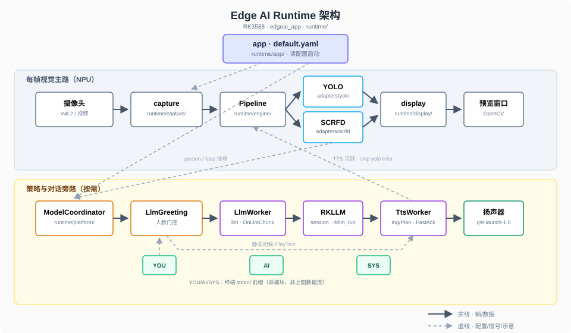

🌐 语言: **中文** | [English](README_EN.md)

# EAI-RK3588: A Plugin-Based Edge AI Platform

**EAI-RK3588** 是一个专为 Rockchip RK3588 设计的可扩展边缘推理平台。它通过一份 YAML 配置文件驱动，结合了多线程视频流水线与插件化架构，并利用协调器实现视觉模型与逻辑组件的按需激活。平台内置 YOLO、SCRFD 模型，并支持本地 RKLLM 对话及语音合成，默认应用展示了人脸门控、AI 问候与对话等功能。

<video src="https://github.com/user-attachments/assets/73a892bb-4fcc-41cf-b8cf-969243fb9511" controls width="100%"></video>

当前默认应用（`default.yaml`）：摄像头视觉、人脸门控板端对话与 TTS；各阶段表现见下表。

## 默认应用


| 阶段          | 用户可见                     | 后台要点                                                                                   |
| ----------- | ------------------------ | -------------------------------------------------------------------------------------- |
| 启动          | 预览窗；`SYS>` 模型加载中 / 就绪    | 读 yaml；预加载 RKLLM、TTS（可选）；同步 Init YOLO                                                  |
| 待机 / 有人     | 人形框；有人后为人脸框              | 场景 idle→person 去抖；person 时启用 SCRFD                                                     |
| 人脸稳定        | `AI>` 问候 + 扬声器播报         | 静态问候 `SetBannerLine` + `PlayText`（`skip_static_greeting=false` 时）                      |
| 用户输入 `YOU>` | 流式 `AI>` → 正式回答语音 | `SubmitPrompt` → `Cancel` → RKLLM → Planner → MeloTTS（短答 Static / 长答 merge）；需 **gst-launch-1.0** |
| 再次 `YOU>`   | 旧播报停止，只跟最新一轮             | `TtsWorker::Cancel`                                                                    |
| 人脸离开        | Grace 内或仍受理；超时后拒新输入      | Locked / Grace 状态机                                                                     |
| 缺 `.rkllm`  | 预览正常，无问候与对话              | 仅视觉模式（`SYS>` 提示）                                                                       |
| 退出          | 关窗                       | ESC / Ctrl+C；释放摄像头与 LLM/TTS                                                            |


终端：`SYS>` / `YOU>` / `AI>` 输出到 stdout；`[INFO]` 等诊断到 stderr。

## 架构设计



实线：视频帧与推理结果。虚线：YAML 与人体/人脸信号。**LLM、TTS 均为逻辑旁路**（`adapters/llm`、`voice/` + `adapters/melotts`），不参与每帧 `Preprocess→Inference→Postprocess`。


| 层       | 目录                                    | 职责                                    |
| ------- | ------------------------------------- | ------------------------------------- |
| 入口      | `runtime/app/`                        | 读 YAML，启动 Pipeline 与 ModelCoordinator |
| 采集 / 显示 | `runtime/capture/` `runtime/display/` | 采帧、旋转、画框、OpenCV 预览                    |
| 引擎      | `runtime/engine/`                     | 预处理 → 推理 → 主线程显示与 stdin               |
| 策略      | `runtime/platform/`                   | 场景切换、人脸门控、自动问候                        |
| 模型      | `runtime/adapters/`                   | yolo / scrfd / llm / tts 插件，按槽与配置启停   |


启动顺序、线程与设计取舍：[docs/architecture-and-runtime.md](docs/architecture-and-runtime.md)（§5–7，与上图互补）

## 快速开始

**环境**：正点原子 RK3588，工具链 `/opt/atk-dlrk3588-toolchain`；将推理模型文件放入 `model/`。

```bash
cd runtime && ./build-linux.sh
adb push install/rk3588_linux_aarch64/rknn_eai_rk3588  <target_directory>
cd <target_directory>/rknn_eai_rk3588
./edgeai_app
```

按板端修改 `config/default.yaml` 中的摄像头、模型路径及 LLM/TTS 开关。

## 配置要点


| 项                                | 作用                                                                  |
| -------------------------------- | ------------------------------------------------------------------- |
| `model.llm.enabled`              | 对话链路；缺 `.rkllm` 时仅视觉                                                |
| `model.tts.enabled`              | 语音播报（启动仍要求 `model.llm.enabled`）                                     |
| `model.tts.skip_static_greeting` | `true` 时不播人脸稳定后的静态问候 TTS                                            |
| 模型路径                             | `model.yolo.path`、`model.scrfd.path`、`model.llm.path`、`model.tts.*` |


**完整字段见** `runtime/config/default.yaml` 注释。

## 本地检查

push 前在仓库根目录运行：

```bash
python3 tools/check_config.py
./tools/check_models.sh
```

- `check_config.py`：校验 `default.yaml` 字段、类型与范围（不检查磁盘文件）。
- `check_models.sh`：按 yaml 检查 `model/` 下 rknn、词表等是否存在；缺 `.rkllm` 为 WARN。

## 文档说明


| 文档                                                                         | 用途                                       |
| -------------------------------------------------------------------------- | ---------------------------------------- |
| [docs/architecture-and-runtime.md](docs/architecture-and-runtime.md) | 启动顺序、Pipeline、槽与平台设计                     |
| [docs/tts-melotts.md](docs/tts-melotts.md)                           | TTS 设计与验收                                |
| [docs/llm-model-coordinator.md](docs/llm-model-coordinator.md)       | RKLLM、门控、终端 UX                           |
| [docs/troubleshooting.md](docs/troubleshooting.md)                   | 0 框、路径错、退出/崩溃；TTS 细节见 TTS 专文              |
| [docs/adapters.md](docs/adapters.md)                               | `adapters/{yolo,scrfd,llm,tts}/` 文件职责          |


## 代码入口


| 用途 | 路径 |
|------|------|
| 启动与读配置 | `runtime/app/main.cc` |
| 每帧流水线 | `runtime/engine/pipeline.cpp` |
| 视觉槽 / 场景 | `runtime/platform/model_coordinator.cpp` |
| 人脸门控 / 问候 | `runtime/platform/llm_greeting.cpp` |
| RKLLM | `runtime/adapters/llm/` |
| TTS | `runtime/voice/` + `runtime/adapters/melotts/` |
| 默认配置 | `runtime/config/default.yaml` |
| 开发辅助 | `tools/`（`check_config.py`、`check_models.sh`） |

**勿随意改**：`runtime/3rdparty/`、`runtime/utils/`（正点原子 / RK 上游）。

## 仓库结构

```text
edgeai_platform/
├── model/          # yolov5.rknn、scrfd.rknn、.rkllm、TTS encoder/decoder RKNN、lexicon.txt、tokens.txt
├── docs/           # 平台文档
├── assets/         # 架构图等
├── runtime/
│   ├── app/ engine/ platform/ capture/ display/
│   ├── adapters/yolo|scrfd|llm|tts/
│   └── config/default.yaml
└── tools/          # 开发/集成辅助（配置校验、模型文件检查等），不参与板端运行
```

## 规划项

- 真实麦克风 / VAD / ASR / 语音打断
- 按键输入（`LlmPromptSource::Button`）
- 更快 TTS 或 YOLO-World 等

## License

MIT License
