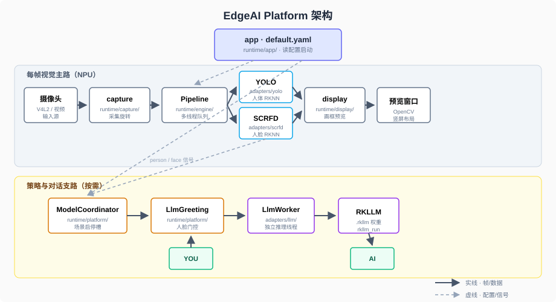

🌐 Language: **English** | [中文](README.md)

# RK3588 Edge AI Inference Platform

**EAI-RK3588** is an extensible edge inference platform for Rockchip RK3588. Driven by a single YAML configuration (runtime/config/default.yaml), it integrates a multi-threaded video pipeline with a plugin-based architecture that enables on-demand activation of vision models (YOLO, SCRFD) and logic components (RKLLM chat, TTS speech) via a coordinator.

<video src="https://github.com/user-attachments/assets/73a892bb-4fcc-41cf-b8cf-969243fb9511" controls width="100%"></video>

The default app (`default.yaml`): camera vision, face-gated on-device dialogue and TTS. Phase-by-phase behavior is in the table below.

## Default app


| Phase             | What you see                                      | What runs                                                                                                         |
| ----------------- | ------------------------------------------------- | ----------------------------------------------------------------------------------------------------------------- |
| Startup           | Preview window; `SYS>` loading / ready            | Load yaml; optional RKLLM/TTS preload; sync YOLO init                                                             |
| Idle / person     | Person boxes; face boxes when someone is present  | Scene debounce idle→person; SCRFD slot on in person                                                               |
| Stable face       | `AI>` greeting + speaker output                   | Static greeting via `SetBannerLine` + `PlayText` when `skip_static_greeting=false`                                |
| User types `YOU>` | Streaming `AI>` → spoken answer | `SubmitPrompt` → `Cancel` → RKLLM → Planner → MeloTTS (short→Static, long→merge); requires **gst-launch-1.0** |
| Another `YOU>`    | Previous speech stops; latest turn wins           | `TtsWorker::Cancel`                                                                                               |
| Face leaves       | May still accept input in Grace; then rejected    | Locked / Grace state machine                                                                                      |
| Missing `.rkllm`  | Preview only, no greeting or chat                 | Vision-only mode (`SYS>` notice)                                                                                  |
| Exit              | Window closes                                     | ESC / Ctrl+C; release camera and LLM/TTS                                                                          |


Terminal: `SYS>` / `YOU>` / `AI>` on stdout; `[INFO]` and similar on stderr.

## Architecture



*Diagram labels are in Chinese; directory paths match this repository.*

Solid lines: video frames and inference results. Dashed lines: YAML and person/face signals. **LLM and TTS are logic side paths** (`adapters/llm`, `voice/` + `adapters/melotts`), not part of per-frame Preprocess→Inference→Postprocess.


| Layer             | Directory                             | Role                                                   |
| ----------------- | ------------------------------------- | ------------------------------------------------------ |
| Entry             | `runtime/app/`                        | Load YAML; start Pipeline and ModelCoordinator         |
| Capture / display | `runtime/capture/` `runtime/display/` | Frames, rotation, overlays, OpenCV preview             |
| Engine            | `runtime/engine/`                     | Preprocess → inference → main-thread display and stdin |
| Policy            | `runtime/platform/`                   | Scene switching, face gate, auto greeting              |
| Models            | `runtime/adapters/`                   | yolo / scrfd / llm / tts plugins, enabled on demand    |


Startup order, threads, and design trade-offs: [docs/architecture-and-runtime_EN.md](docs/architecture-and-runtime_EN.md) (§5–7; complements the diagram above).

## Quick start

**Environment**: ALIENTEK RK3588, toolchain `/opt/atk-dlrk3588-toolchain`; place model files under `model/`.

```bash
cd runtime && ./build-linux.sh
adb push install/rk3588_linux_aarch64/rknn_eai_rk3588  <target_directory>
cd <target_directory>/rknn_eai_rk3588
./edgeai_app
```

Adjust camera, model paths, and LLM/TTS switches in `config/default.yaml` for your board.

## Configuration


| Key                              | Effect                                                                 |
| -------------------------------- | ---------------------------------------------------------------------- |
| `model.llm.enabled`              | Dialogue pipeline; vision-only if `.rkllm` is missing                  |
| `model.tts.enabled`              | Speech output (still requires `model.llm.enabled` at startup)          |
| `model.tts.skip_static_greeting` | Skip static greeting TTS after stable face when `true`                 |
| Model paths                      | `model.yolo.path`, `model.scrfd.path`, `model.llm.path`, `model.tts.*` |


**See comments in** `runtime/config/default.yaml`.

## Local checks

Run before push from repo root:

```bash
python3 tools/check_config.py
./tools/check_models.sh
```

- `check_config.py`: validates `default.yaml` keys, types, and ranges (no filesystem checks).
- `check_models.sh`: checks rknn/lexicon paths from yaml; missing `.rkllm` is WARN.

## Documentation


| Doc                                                                  | Purpose                                                         |
| -------------------------------------------------------------------- | --------------------------------------------------------------- |
| [docs/architecture-and-runtime_EN.md](docs/architecture-and-runtime_EN.md) | Startup order, Pipeline, slots, platform design                 |
| [docs/tts-melotts_EN.md](docs/tts-melotts_EN.md)                           | TTS design and acceptance                                       |
| [docs/llm-model-coordinator_EN.md](docs/llm-model-coordinator_EN.md)       | RKLLM, gate, terminal UX                                        |
| [docs/troubleshooting_EN.md](docs/troubleshooting_EN.md)                   | Zero boxes, wrong paths, exit/crash; TTS details in TTS doc     |
| [docs/adapters_EN.md](docs/adapters_EN.md)                                 | `adapters/{yolo,scrfd,llm,tts}/` file roles                     |


## Code entry points


| Purpose | Path |
|---------|------|
| Startup and config | `runtime/app/main.cc` |
| Per-frame pipeline | `runtime/engine/pipeline.cpp` |
| Vision slots / scenes | `runtime/platform/model_coordinator.cpp` |
| Face gate / greeting | `runtime/platform/llm_greeting.cpp` |
| RKLLM | `runtime/adapters/llm/` |
| TTS | `runtime/voice/` + `runtime/adapters/melotts/` |
| Default config | `runtime/config/default.yaml` |
| Dev helpers | `tools/` (`check_config.py`, `check_models.sh`) |

**Do not edit casually**: `runtime/3rdparty/`, `runtime/utils/` (upstream ALIENTEK / RK).

## Repository layout

```text
edgeai_platform/
├── model/          # yolov5.rknn, scrfd.rknn, .rkllm, TTS encoder/decoder RKNN, lexicon.txt, tokens.txt
├── docs/           # platform docs
├── assets/         # architecture diagram, etc.
├── runtime/
│   ├── app/ engine/ platform/ capture/ display/
│   ├── adapters/yolo|scrfd|llm|tts/
│   └── config/default.yaml
└── tools/          # dev/integration helpers (config & model checks, etc.), not used on board
```

## Backlog

- Real microphone / VAD / ASR / barge-in
- Button input (`LlmPromptSource::Button`)
- Faster TTS or YOLO-World, etc.

## License

MIT License
