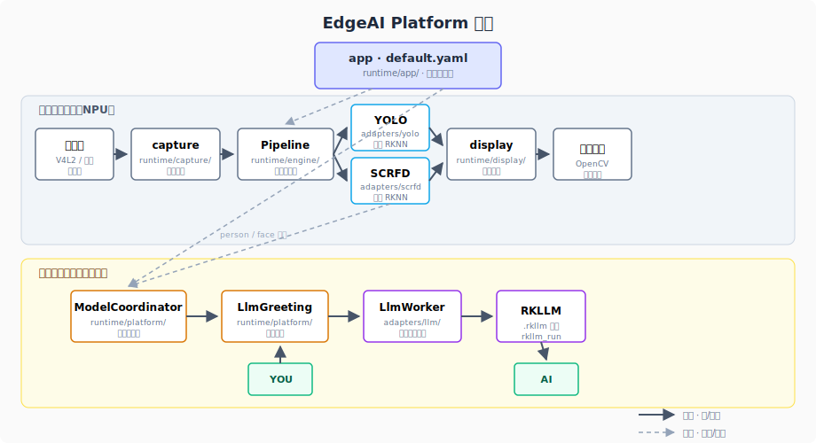
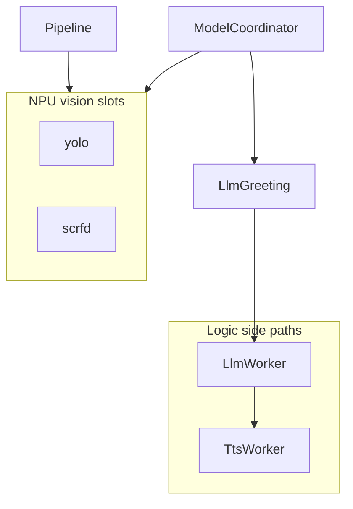
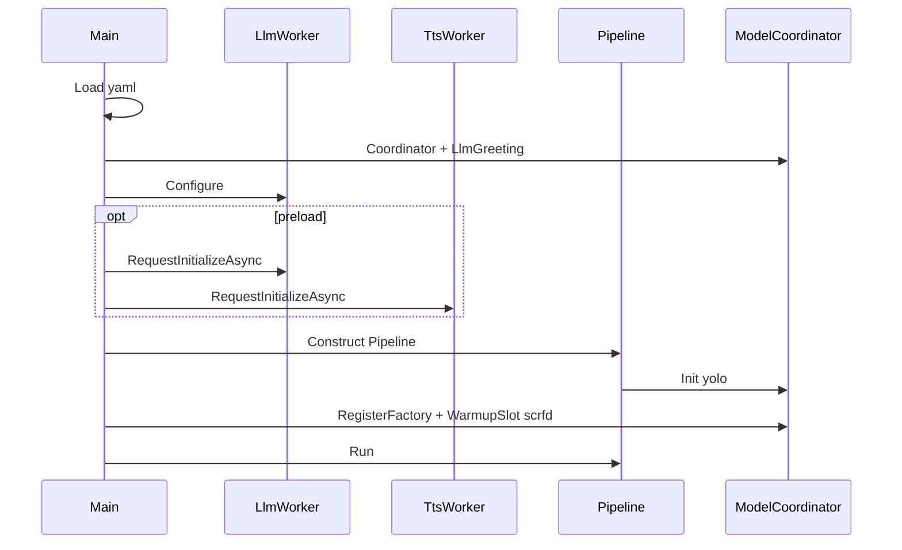
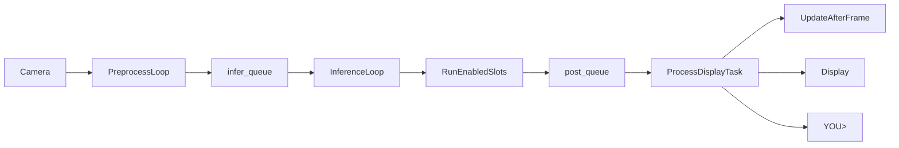

Language: **English** | [中文](architecture-and-runtime_CN.md)

# Architecture and runtime

> **Edge AI Runtime** platform doc on RK3588: layers, slots, startup/runtime order, design trade-offs.  
> **Reference app**: face detection + dialogue + TTS under `default.yaml` (not the only product shape).  
> Module detail and acceptance: topic docs in [README.md](README.md); implementation: `runtime/` code.

---

## 1. Scope, boundaries, reference timeline

**Platform**: `edgeai_platform_app` + `runtime/` + `config/default.yaml` + `adapters/` plugins. New vision slots, coordinator scenes, or logic side paths (`LlmWorker` / `TtsWorker`) **do not** require Pipeline core changes.


| On board                         | Out of scope              |
| -------------------------------- | ------------------------- |
| `runtime/`, `model/*.rknn` / `.rkllm` / lexicon | Repo root `verify/` (PC only) |
| `3rdparty`, `utils` (link only)  | Cursor worktree copies    |




*Solid: frames/data; dashed: config and person/face signals. TTS modules: [tts-melotts.md](tts-melotts.md) §3–4; startup and threads: this doc §5–6.*

**Default reference app** (preview + terminal `SYS>`/`YOU>`/`AI>` + speaker):


| Phase            | Terminal / audio              | Backend                          |
| ---------------- | ----------------------------- | -------------------------------- |
| Missing `.rkllm` | `SYS> 仅视觉模式…`; no greeting | `Failed`, no `rkllm_init`        |
| Loading          | `SYS> 对话模型加载中…`          | `Initializing`                   |
| Idle → approach  | Ready → `输入通道已就绪…`       | idle → person → scrfd on         |
| Stable face      | `AI>` greeting + TTS          | Active, `SetBannerLine`          |
| Question         | `YOU>` → stream `AI>`; TTS    | `rkllm_run` + Planner            |
| Re-ask / leave   | New `YOU>` cancels audio      | Gate / `prompt_gate`             |


Security-only products: disable `model.llm` or change slot policy; reuse the kernel.

---

## 2. Layers, layout, principles

```text
runtime/
├── app/          # main, ConfigParser
├── engine/       # Pipeline, IModelAdapter, queues
├── platform/     # ModelCoordinator, LlmGreeting
├── adapters/     # yolo, scrfd, llm, tts
├── capture/ display/
├── config/default.yaml   # sole default config (main does not fallback)
├── utils/, 3rdparty/    # do not edit
```


| Layer        | Role                                              |
| ------------ | ------------------------------------------------- |
| **app**      | Load yaml; wire Coordinator / LLM / TTS / Pipeline |
| **engine**   | Capture → infer → main-thread display and policy  |
| **platform** | Vision slot on/off, scene debounce, face gate    |
| **adapters** | Vision: `IModelAdapter`; LLM/TTS: logic side paths |


- Vision: **per frame** `Preprocess → Inference → Postprocess` (`RunEnabledSlots`).
- LLM / TTS: **not** vision slots; own threads and lifecycle.

---

## 3. Design trade-offs (summary)


| Topic        | Current choice                         | Why not alternatives                    |
| ------------ | -------------------------------------- | --------------------------------------- |
| Dialogue     | `LlmWorker` side path + `infer_thread_` | LLM in per-frame Pipeline blocks UI/stdin |
| Multi-RKNN   | scene Enable/Disable + **warm pool**   | Always-on fills NPU; disable ≠ destroy  |
| LLM preload  | `preload_on_startup` **before** YOLO Init | Lower first-reply latency; **stat** → vision-only |
| Greeting     | yaml static `SetBannerLine`, no RKLLM  | Deterministic, zero tokens              |
| TTS          | `TtsWorker` + Melo RKNN + gst PCM      | Demo voice feedback                     |
| Terminal     | `SYS>` / `YOU>` / `AI>` on stdout      | Board-friendly debugging                |


---

## 4. Two “slot” kinds and signals




| Name      | Type   | On/off                                      |
| --------- | ------ | ------------------------------------------- |
| `yolo`    | Vision | idle/person + `yolo_always_on`; warm pool   |
| `scrfd`   | Vision | person; `WarmupSlot`                      |
| LLM / TTS | Logic  | `model.llm` / `model.tts` + gate            |


`GetAdapterSignals()` → `MergeSlotSignals` → `UpdateAfterFrame` → slot plan + `LlmGreeting::Update`.

---

## 5. Startup order

**Rule**: LLM/TTS `preload_on_startup` runs **before** Pipeline/YOLO Init when `enabled`.




| Step | Action                                                                 |
| ---- | ---------------------------------------------------------------------- |
| 1–2  | Load yaml; Coordinator + gate params                                 |
| 3–4  | LLM/TTS `Configure`; optional async init (**stat fail → Failed**, no `rkllm_init`) |
| 5–6  | Pipeline: camera → `Init(yolo)` → scrfd warmup into warm pool          |
| 7    | `Run()` → `LogStartupHint()` one `SYS>`; exit via `Shutdown`           |


`SYS>` and Failed/Ready text: [llm-model-coordinator.md](llm-model-coordinator.md) §5. Entry: [`app/main.cc`](../runtime/app/main.cc), [`pipeline.cpp`](../runtime/engine/pipeline.cpp).

---

## 6. Runtime: Pipeline, threads, shutdown




| Thread           | Role                                              |
| ---------------- | ------------------------------------------------- |
| `pre_thread_`    | Capture; drop frames when queue full              |
| `infer_threads_` | Enabled vision slots three-phase                  |
| **Main**         | Draw/overlay, display, `PollTerminalPromptInput`  |


Notes: `UpdateAfterFrame` before draw; suppress YOLO person boxes when yolo+scrfd; end of frame `PollDeferred()` (LLM/TTS init and TTS events).

**Shutdown**: `Stop()` → `AbortActiveGeneration`, release camera, quit sentinels → `tts`/`llm` `Shutdown()`. Issues: [troubleshooting.md](troubleshooting.md).

---

## 7. ModelCoordinator (vision policy)

1. **Scenes**: `idle` / `person` from debounced `person_present` + `scene_dwell_frames`.
2. **Slot plan**: Idle → yolo (optional always_on); Person → yolo + scrfd.
3. **Warm pool**: `DisableSlot` does not destroy RKNN; `EnableSlot` reuses when possible.
4. **NPU**: `npu_cores[0]`→yolo, `[1]`→scrfd.

---

## 8. Logic side paths (summary; see topic docs)


| Capability              | In platform                                                         | Topic doc                                      |
| ----------------------- | ------------------------------------------------------------------- | ---------------------------------------------- |
| **Gate / greet / `YOU>`** | `LlmGreeting`: Locked→Arming→Active→Grace; `prompt_gate` needs `IsReady()` | [llm-model-coordinator.md](llm-model-coordinator.md) |
| **RKLLM**               | `infer_thread_` + `rkllm_run`; chunks → `PollDeferred`              | same                                           |
| **TTS**                 | FastAck → Ingress → Planner → synth/play; when active **skip yolo infer only** | [tts-melotts.md](tts-melotts.md) (**acceptance**) |
| **Adapter files**       | `adapters/{yolo,scrfd,llm,tts}/`                                    | [adapters.md](adapters.md)                     |


---

## 9. Config map (common keys)


| yaml key                                                       | Effect              |
| -------------------------------------------------------------- | ------------------- |
| `model.yolo.path` / `model.scrfd.*`                            | Detection boxes     |
| `system.slots.yolo_always_on`, `system.switch.*`               | Scene and debounce  |
| `model.llm.enabled`, `preload_on_startup`, `auto_greeting_text`  | Dialogue and greet  |
| `model.tts.enabled`, `model.tts.qos.*`, `model.tts.planner.*`  | Speech and buffer   |
| `input.show_window`                                            | Preview window      |


Full comments: [`runtime/config/default.yaml`](../runtime/config/default.yaml).

---

## 10. Continue development

```bash
cd runtime && ./build-linux.sh
cd install/rk3588_linux_aarch64/rknn_edgeai_platform
./edgeai_platform_app config/default.yaml
```

Board models: `./model/`; `verify/` not used at runtime. Backlog (VAD/button/YOLO-World): [README.md](README.md).

---

## 11. Related docs

Reading order and index: **[README.md](README.md)**.

*On conflict with topic docs, code wins.*
