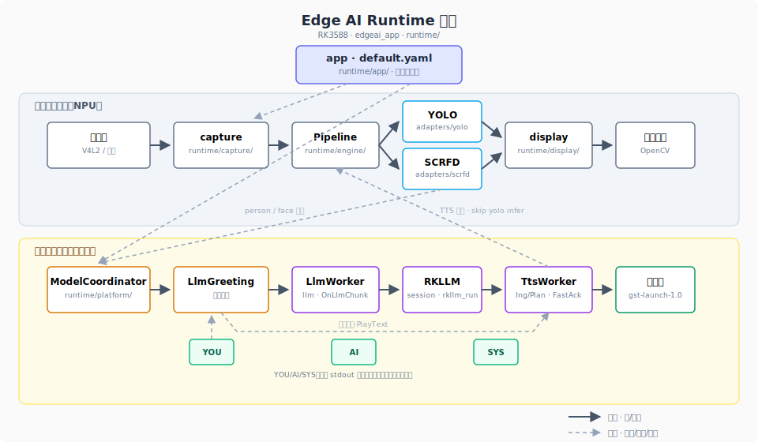
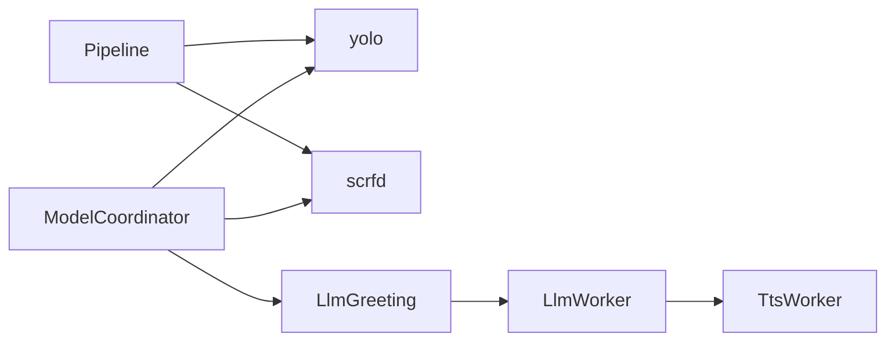
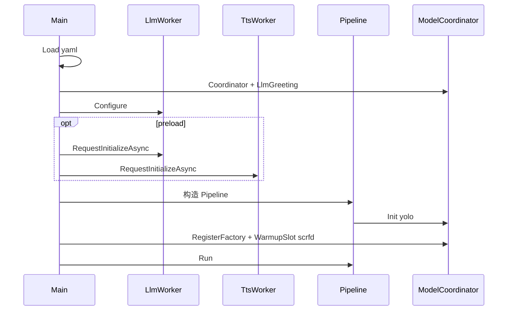
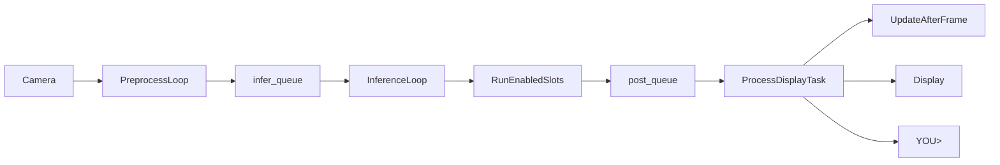

Language: **中文** | [English](architecture-and-runtime.md)

# 系统架构与运行逻辑

> **Edge AI Runtime** 在 RK3588 上的平台主文档：分层、槽关系、启动/运行时顺序、设计取舍。  
> **参考应用**：`default.yaml` 下的人脸检测 + 对话 + TTS（非唯一形态）。  
> 单模块细节与验收见 [README_CN.md](README_CN.md) 所列专文；实现以 `runtime/` 代码为准。

---

## 1. 定位、边界与参考应用时间线

**平台**：`edgeai_app` + `runtime/` + `config/default.yaml` + `adapters/` 插件。扩展视觉槽、协调器场景或逻辑旁路（`LlmWorker` / `TtsWorker`）**不必**改 Pipeline 内核。



*实线：帧/数据；虚线：配置与 person/face 信号。TTS 模块细节见 [tts-melotts_CN.md](tts-melotts_CN.md) §3–4；启动与线程见本文 §5–6。*

**默认参考应用**（预览 + 终端 `SYS>`/`YOU>`/`AI>` + 扬声器）：


| 阶段         | 终端 / 语音要点                            | 后台                       |
| ---------- | ------------------------------------ | ------------------------ |
| 缺 `.rkllm` | `SYS> 仅视觉模式…`；无问候                    | `Failed`，不调 `rkllm_init` |
| 加载中        | `SYS> 对话模型加载中…`                      | `Initializing`           |
| 待机 → 走近    | Ready 后 `输入通道已就绪…`                   | idle → person → 启用 scrfd |
| 驻足         | `AI>` 问候 + TTS                       | Active，`SetBannerLine`   |
| 提问         | `YOU>` → 流式 `AI>`；FastAck + 流式正式 TTS | `rkllm_run` + Planner    |
| 连问 / 离开    | 新 `YOU>` Cancel 旧音；Grace 后拒输入        | 门控 / `prompt_gate`       |


纯安防等场景：关 `model.llm` / 改槽策略即可，内核复用。

---

## 2. 分层、目录与核心原则

```text
runtime/
├── app/          # main、ConfigParser
├── engine/       # Pipeline、IModelAdapter、队列
├── platform/     # ModelCoordinator、LlmGreeting
├── adapters/     # yolo、scrfd、llm、tts
├── capture/ display/
├── config/default.yaml   # 唯一默认配置源（main 不兜底）
├── utils/、3rdparty/     # 勿改
```


| 层       | 目录                                    | 职责                                                                 |
| ------- | ------------------------------------- | ------------------------------------------------------------------ |
| 入口      | `runtime/app/`                        | 读 YAML，启动 Pipeline 与 ModelCoordinator                            |
| 采集 / 显示 | `runtime/capture/` `runtime/display/` | 采帧、旋转、画框、OpenCV 预览                                               |
| 引擎      | `runtime/engine/`                     | Pipeline、队列；Preprocess → Inference → Postprocess；主线程显示与 stdin |
| 策略      | `runtime/platform/`                   | 视觉槽启停、场景去抖、人脸门控                                                  |
| 模型      | `runtime/adapters/`                   | 视觉：`IModelAdapter`；LLM/TTS：逻辑旁路                                  |


- 视觉：**每帧** `Preprocess → Inference → Postprocess`（`RunEnabledSlots`）。
- LLM / TTS：**不进**视觉槽，独立线程与生命周期。

---

## 3. 设计取舍（摘要）


| 决策点     | 现行                                    | 为何不选备选                       |
| ------- | ------------------------------------- | ---------------------------- |
| 对话位置    | `LlmWorker` 旁路 + `infer_thread_`      | LLM 进每帧 Pipeline 会卡显示与 stdin |
| 多 RKNN  | 场景 Enable/Disable + **warm 池**        | 常开占满 NPU；禁用不 destroy         |
| LLM 预加载 | `preload_on_startup` **先于** YOLO Init | 减首句延迟；缺文件 **stat 预检** → 仅视觉  |
| 问候      | yaml 静态 `SetBannerLine`，不经 RKLLM      | 确定、零 token                   |
| TTS     | `TtsWorker` + Melo RKNN + gst PCM     | 展台语音反馈                       |
| 终端      | `SYS>` / `YOU>` / `AI>` 分流            | 板端调试友好                       |


---

## 4. 两类「槽」与信号链




| 名称        | 类型  | 启停                                    |
| --------- | --- | ------------------------------------- |
| `yolo`    | 视觉  | idle/person + `yolo_always_on`；warm 池 |
| `scrfd`   | 视觉  | person；`WarmupSlot`                   |
| LLM / TTS | 逻辑  | `model.llm` / `model.tts` + 门控        |


`GetAdapterSignals()` → `MergeSlotSignals` → `UpdateAfterFrame` → 槽计划 + `LlmGreeting::Update`。

---

## 5. 启动顺序

**约定**：LLM/TTS 的 `preload_on_startup` 在 Pipeline/YOLO Init **之前**（`enabled` 为开关）。




| 阶段  | 动作                                                                |
| --- | ----------------------------------------------------------------- |
| 1–2 | 加载 yaml；Coordinator + 门控参数                                        |
| 3–4 | LLM/TTS `Configure`；可选异步 init（**stat 失败 → Failed，不调 rkllm_init**） |
| 5–6 | Pipeline：摄像头 → `Init(yolo)` → scrfd 预热入 warm 池                    |
| 7   | `Run()` → `LogStartupHint()` 一条 `SYS>`；退出 `Shutdown`              |


`SYS>` 与 Failed/Ready 文案详见 [llm-model-coordinator_CN.md](llm-model-coordinator_CN.md) §5。入口：`[app/main.cc](../runtime/app/main.cc)`、`[pipeline.cpp](../runtime/engine/pipeline.cpp)`。

---

## 6. 运行时：Pipeline、线程与退出




| 线程               | 职责                                    |
| ---------------- | ------------------------------------- |
| `pre_thread_`    | 采帧；队列满则丢帧                             |
| `infer_threads_` | 当前 enabled 视觉槽三阶段                     |
| **主线程**          | 画框/badge、显示、`PollTerminalPromptInput` |


要点：`UpdateAfterFrame` 在绘制前；yolo+scrfd 时抑制 YOLO person 框；每帧末 `PollDeferred()`（LLM/TTS init 与 TTS 事件）。

**退出**：`Stop()` → `AbortActiveGeneration`、释放相机、quit 哨兵 → `tts`/`llm` `Shutdown()`。异常见 [troubleshooting_CN.md](troubleshooting_CN.md)。

---

## 7. ModelCoordinator（视觉策略）

1. **场景**：`idle` / `person` ← `person_present` 去抖 + `scene_dwell_frames`。
2. **槽计划**：Idle → yolo（可选 always_on）；Person → yolo + scrfd。
3. **warm 池**：`DisableSlot` 不 destroy RKNN；`EnableSlot` 优先复用。
4. **NPU**：`npu_cores[0]`→yolo，`[1]`→scrfd。

---

## 8. 逻辑旁路（摘要，细节见专文）


| 能力                   | 平台内位置                                                                | 专文                                                     |
| -------------------- | -------------------------------------------------------------------- | ------------------------------------------------------ |
| **门控 / 问候 / `YOU>`** | `LlmGreeting`：Locked→Arming→Active→Grace；`prompt_gate` 须 `IsReady()` | [llm-model-coordinator_CN.md](llm-model-coordinator_CN.md) |
| **RKLLM**            | `infer_thread_` + `rkllm_run`；chunk → `PollDeferred`                 | 同上                                                     |
| **TTS**              | FastAck → Ingress → Planner → 合成/播放；TTS 活跃时 **仅跳 yolo 推理**           | [tts-melotts_CN.md](tts-melotts_CN.md)（**验收**）       |
| **适配器文件**            | `adapters/{yolo,scrfd,llm,tts}/`                                     | [adapters_CN.md](adapters_CN.md)                                   |


---

## 9. 配置映射（常用键）


| yaml 键                                                        | 效果      |
| ------------------------------------------------------------- | ------- |
| `model.yolo.path` / `model.scrfd.`*                           | 检测框     |
| `system.slots.yolo_always_on`、`system.switch.*`               | 场景与去抖   |
| `model.llm.enabled`、`preload_on_startup`、`auto_greeting_text` | 对话链路与问候 |
| `model.tts.enabled`、`model.tts.qos.*`、`model.tts.planner.*`   | 语音与开播缓冲 |
| `input.show_window`                                           | 预览窗     |


完整注释见 `[runtime/config/default.yaml](../runtime/config/default.yaml)`。

---

## 10. 相关文档

阅读顺序与索引见 **[README_CN.md](README_CN.md)**。

*与专文冲突时以代码为准。*
