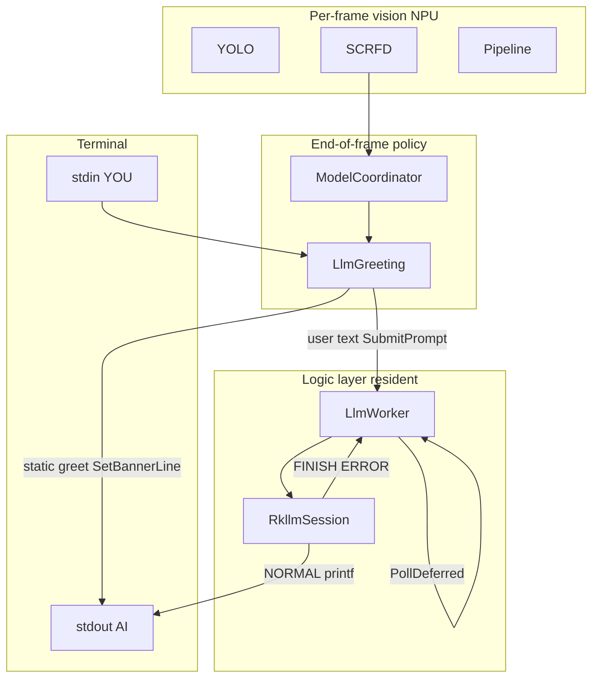
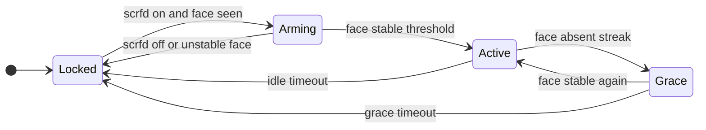

Language: **English** | [中文](llm-model-coordinator_CN.md)

# LLM and ModelCoordinator integration

## For readers

- This doc covers RKLLM (DeepSeek and other `.rkllm` models) layout in runtime, boundary vs the vision pipeline, face gate and session FSM, and mic/button extension.
- LLM is a **logic-layer** capability: **no** `IModelAdapter`, **not** in `RunEnabledSlots` / per-frame `Preprocess→Inference→Postprocess`.
- TTS is a parallel side path: LLM chunks via `OnLlmChunk` → main-thread `PollDeferred` → Ingress/Planner → `EnqueueFormalAnswer` (see TTS doc).
- Behavior matches current code; §4 is product spec; §7 is backlog.

**Related code:**

| Module | Path |
|--------|------|
| RKLLM wrapper | [`adapters/llm/rkllm_session.*`](../runtime/adapters/llm/rkllm_session.cpp) |
| Inference and queue | [`adapters/llm/llm_worker.*`](../runtime/adapters/llm/llm_worker.cpp) |
| Face gate and session | [`platform/llm_greeting.*`](../runtime/platform/llm_greeting.cpp) |
| Multi-slot per-frame policy | [`platform/model_coordinator.cpp`](../runtime/platform/model_coordinator.cpp) |
| Terminal input | [`engine/pipeline.cpp`](../runtime/engine/pipeline.cpp) `PollTerminalPromptInput` |

---

## 1. Why `adapters/llm`

| Item | Note |
|------|------|
| Consistency | Same level as `adapters/yolo`, `scrfd`; linked into `edgeai_platform_app` |
| API | `rkllm_init` / **sync `rkllm_run`** / callbacks → `rkllm_session` |
| Third party | `runtime/3rdparty/rkllm/`: `rkllm.h`, `librkllmrt.so`, `libgomp.so` |

Adapter files: [adapters.md](adapters.md) § LLM.

---

## 2. Integration options (conclusion)

| Option | Verdict |
|--------|---------|
| **A. `adapters/llm` + `LlmGreeting` + dedicated infer thread** | **Chosen** |
| B. Per-frame `IModelAdapter` llm slot | Not recommended |
| C. Sync `rkllm_run` in coordinator or main loop | Not recommended; today **`rkllm_run` on `infer_thread_`** |
| E. Cloud API | Out of scope |

---

## 3. Architecture



- **Auto greeting** does not use `Worker→RK` above (see §4.1).
- `ModelCoordinator::UpdateAfterFrame` calls `LlmGreeting::Update`; `llm_greeting_.PollDeferred()` finishes init and runs the next queued prompt.

---

## 4. Data and control flow (current)

```text
[Auto greet] stable face → TryAutoPromptOnStableFace → SetBannerLine(auto_greeting_text_) → stdout AI>
  (no rkllm_run; not inserted when busy)

[User chat] stdin YOU> → SubmitUserPrompt → SubmitPrompt (Cancel + PlayFastAck)
    → infer_thread_: fprintf("AI> ") → RunPromptSync → rkllm_run
    → StaticCallback: NORMAL printf("%s"); FINISH printf("\n")
    → OnLlmChunk: NORMAL/FINISH post TTS chunk events; FINISH queues deferred work
    → PollDeferred: DrainDeferredTtsEvents → TTS; next sentence RunPromptNow
```

| File | Role |
|------|------|
| `rkllm_session.cpp` | Sole `rkllm_*` caller; `RunPromptSync`; callbacks to stdout |
| `llm_worker.cpp` | Async `rkllm_init` (**stat first**); `IsLoadFailed`; `infer_thread_`; `SubmitPrompt` queue |
| `llm_greeting.cpp` | Locked/Arming/Active/Grace; gate; static greet; **vision-only** UX |
| `model_coordinator.cpp` | Vision slots; per-frame `PollDeferred` |
| `pipeline.cpp` | Terminal `YOU>` |

**InitOnce:** After first successful `rkllm_init`, model stays loaded; face leave does **not** `rkllm_destroy`. Async load via `std::async` affects cold start only.

**Latency factors:** YOLO + SCRFD vs LLM on NPU/bandwidth; `[INFO]` on stderr, session lines on stdout.

---

## 4.1 TTS coordination

```text
YOU> -> SubmitPrompt (Cancel + PlayFastAck)
     -> rkllm_run -> OnLlmChunk (NORMAL/FINISH) -> tts_events_
     -> PollDeferred -> TtsIngress -> TtsPlanner -> EnqueueFormalAnswer
     -> TtsWorker synth/play (see TTS doc)
```

- Each `YOU>`: `desired_tts_session_id_++`, drop old generation text/PCM.
- `LlmGreeting` owns the gate; TTS only sees Ingress-filtered visible text.
- Acceptance and debug: [tts-melotts.md](tts-melotts.md).

---

## 5. Terminal UX

| Prefix | Source | Path |
|--------|--------|------|
| `SYS>` | System | `LogSystem` → stdout |
| `YOU>` | User | `Pipeline::PollTerminalPromptInput` |
| `AI>` | **User chat** | `RunPromptNow` prefix + `StaticCallback` stream |
| `AI>` | **Auto greet** | `SetBannerLine` once from config (**only when `IsReady()`**) |

**`SYS>` vs LLM state (`model.llm.enabled=true`)**

| When | Message (Chinese in product) |
|------|------------------------------|
| Missing file / `rkllm_init` fail | Vision-only, model not loaded |
| `Pipeline::Run` while loading | Model loading, please wait |
| `Pipeline::Run` when Ready | Input channel ready after stable face |
| Async init OK (`PollInitState`) | Model ready, input after stable face |
| `YOU>` when `IsLoadFailed` | Dialogue unavailable (once per session) |
| Gate closed (no stable face) | No stable face, input rejected |

On `Failed`, **no repeat** startup `SYS>` (precheck/init already logged once).

- User chat does **not** stream via `SetBannerLine` (`OnLlmChunk` ignores NORMAL for that).
- `LLM_OUT|...` is debug summary from `SetBannerLine` on `is_final` (greeting, etc.).
- LLM is not drawn on `ResultOverlay` detection layer.

---

## 6. Specified behavior

### 6.1 Prompts and generation

| Case | Behavior |
|------|----------|
| **Generating** | Finish current sentence; face leave/Grace does **not** `rkllm_abort` |
| **Stable face (first/return)** | **`IsReady()`** → **`auto_greeting_text`** via `SetBannerLine`; `FaceReenter` only changes log source |
| **Missing `.rkllm` / load fail** | **Vision-only**: no `AI>` greet; gate closed; vision OK |
| **Face stays** | No auto multi-turn; wait for **terminal** (mic wired) or future button |
| **Face leaves** | Close gate; `DropQueuedPrompts`; current RKLLM sentence still completes |
| **Process exit** | `Pipeline::Stop` → `AbortActiveGeneration` → `Shutdown` / `rkllm_destroy` |

### 6.2 Model lifecycle

| Event | Action |
|-------|--------|
| First need LLM | `RequestInitializeAsync`: **stat OK** then `rkllm_init`; missing file → `Failed`, no init |
| Load fail (`Failed`) | `IsLoadFailed()`; no more `RequestInitializeAsync` this process; vision-only UX |
| Face leave / grace / idle timeout | Close gate, clear queue; **do not** unload model |
| Face stable again | Open gate when **`IsReady()`**; static greet again (new visit) |
| Load done (`PollDeferred`) | `TryOpenDialogueIfReady`: gate + greet if needed |
| Process exit | `LlmWorker::Shutdown` |

### 6.3 Explicitly out of scope

- Periodic RKLLM turns without user input.
- LLM as a per-frame vision slot.
- `rkllm_destroy` on face leave (conflicts with quick return).

### 6.4 Session FSM



`LlmWorker`: `Uninitialized → Initializing → Ready` or **`Failed`**; `Ready ↔ Generating` on `infer_thread_` during `rkllm_run`.

`prompt_gate_open_` opens on stable face only when **`LlmWorker::IsReady()`**; `Active` session ≠ “can chat” (Failed may show face box but no input).

### 6.5 SCRFD

- Stable `person` → `EnableSlot("scrfd")`.
- Auto greet and gate use `face_detected` + `face_stable_frames`, not per-frame RKLLM.
- SCRFD five-point overlay: TODO (unrelated to LLM).

---

## 7. Mic / button / backlog

**Wired:** `Pipeline` → `LlmGreeting::SubmitUserPrompt` → `SubmitPrompt(..., Microphone, gate)`.

**Not wired:** button → `SubmitPrompt(..., Button)`; `allow_input_without_face` config.

```text
LlmPromptSource: FaceAppear | FaceReenter | Microphone | Button | Command
```

| Backlog | Note |
|---------|------|
| Button input | `Button` source |
| SCRFD five-point overlay | coords in postprocess; draw TODO |
| On-screen logs | state changes mostly `LogDebug`; FPS `LogInfo` may be frequent |

---

## 8. Configuration

See [`config/default.yaml`](../runtime/config/default.yaml):

```yaml
model:
  llm:
    enabled: true
    path: ./model/deepseek-1.5b-w8a8-rk3588.rkllm
    max_new_tokens: 4096
    max_context_len: 4096
    preload_on_startup: true
    preload_on_scrfd: true
    face_stable_frames: 5
    face_absent_frames: 10
    grace_timeout_ms: 5000
    idle_timeout_ms: 60000
    auto_greeting_text: "..."   # static greet, no rkllm_run
```

`enabled`: `true`/`false` via `ConfigParser::GetBool`.

---

## 9. Debug logs

| Log | Meaning |
|-----|---------|
| `LlmWorker: model file missing or unreadable, skip rkllm_init` | stat failed → vision-only |
| `SYS> 仅视觉模式（对话模型未加载）` | User-facing vision-only |
| `LlmWorker: async InitOnce start` | stat OK, loading `.rkllm` |
| `LlmWorker: rkllm_init ok` | Success; should not repeat init |
| `SYS> 对话模型已就绪，人脸稳定后可输入` | Async init OK |
| `LlmGreeting: auto greeting emitted` | Static greet sent (must be Ready) |
| `LlmGreeting: reject input gate_open=0` | Gate reject (Debug) |
| `SYS> 对话不可用（模型未加载）` | `YOU>` rejected on Failed |
| `LlmGreeting: state ... -> ...` | Session transition (often Debug) |
| Terminal `YOU>` / `AI>` | User / RKLLM or static greet |
| `LlmWorker: queued one prompt (busy)` | One prompt queued while busy |
| `LlmWorker: rkllm_run failed` | Sync infer failed |
| `LLM_OUT\|src=...\|text=...` | `SetBannerLine` final debug |

Diagnostics on **stderr**; session on **stdout**.

---

## 10. Enable on board

1. Place `.rkllm` at `model.llm.path`.
2. `model.llm.enabled: true`.
3. `cd runtime && ./build-linux.sh`.
4. `cd install/rk3588_linux_aarch64/rknn_edgeai_platform && ./edgeai_platform_app config/default.yaml`.
5. Expected (model ready): `scene -> person` → `scrfd` in slots → one `rkllm_init ok` → stable face → static `AI>` → `YOU>` → streaming `AI>`.
6. Missing `.rkllm`: vision-only `SYS>`; vision OK; no greet; `YOU>` rejected.

---

## 11. Related docs

| Doc | Use |
|-----|-----|
| [architecture-and-runtime.md](architecture-and-runtime.md) | Platform overview, load order |
| [tts-melotts.md](tts-melotts.md) | TTS design and acceptance |
| [adapters.md](adapters.md) § LLM | LLM adapter cheat sheet |
| [troubleshooting.md](troubleshooting.md) | Vision, exit, crash |
| [README.md](README.md) | Documentation index |

---

*Authoritative: `runtime/` code.*
