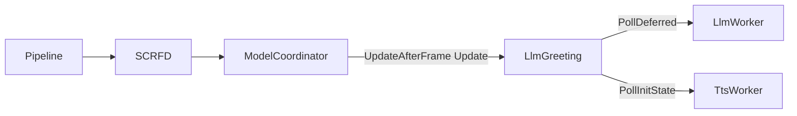
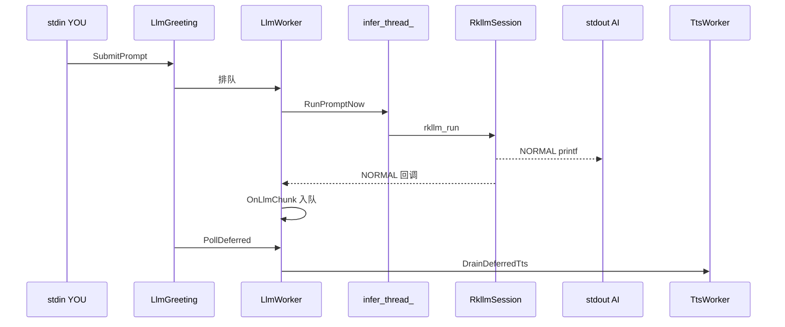
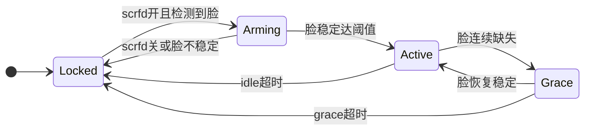

Language: **中文** | [English](llm-model-coordinator.md)

# LLM 与 ModelCoordinator 集成

## 读者须知

- 本文说明 RKLLM（DeepSeek 等 `.rkllm`）在 runtime 中的目录、与视觉流水线的边界、人脸门控与会话状态机，以及麦克风/按键扩展方式。
- LLM 为**逻辑层能力**：**不**实现 `IModelAdapter`，**不**进入 `RunEnabledSlots` / 每帧 `Preprocess→Inference→Postprocess`。
- TTS 为并列旁路：LLM chunk 经 `OnLlmChunk` 投递事件，主线程 `PollDeferred` → Ingress/Planner → `EnqueueFormalAnswer`（详见 TTS 主文档）。
- 实现以当前代码为准；§4 为产品行为定稿，§7 为未完成项。

**相关代码：**

| 模块 | 路径 |
|------|------|
| RKLLM 封装 | [`adapters/llm/rkllm_session.*`](../runtime/adapters/llm/rkllm_session.cpp) |
| 推理与排队 | [`adapters/llm/llm_worker.*`](../runtime/adapters/llm/llm_worker.cpp) |
| 人脸门控与会话 | [`platform/llm_greeting.*`](../runtime/platform/llm_greeting.cpp) |
| 多槽与每帧策略 | [`platform/model_coordinator.cpp`](../runtime/platform/model_coordinator.cpp) |
| 终端输入 | [`engine/pipeline.cpp`](../runtime/engine/pipeline.cpp) `PollTerminalPromptInput` |

---

## 1. 为何放在 `adapters/llm`

| 项 | 说明 |
|----|------|
| 一致性 | 与 `adapters/yolo`、`scrfd` 同级，统一编入 `edgeai_app` |
| API | `rkllm_init` / **`rkllm_run`（同步）** / callback → `rkllm_session` |
| 第三方 | `runtime/3rdparty/rkllm/`：`rkllm.h`、`librkllmrt.so`、`libgomp.so` |

适配器文件与路径速览见 [adapters_CN.md](adapters_CN.md) § LLM。

---

## 2. 挂钩方案（结论）

| 方案 | 结论 |
|------|------|
| **A. `adapters/llm` + `LlmGreeting` + 独立推理线程** | **采用** |
| B. `IModelAdapter` 每帧 llm 槽 | 不推荐 |
| C. 在协调器或主循环内同步 `rkllm_run` | 不推荐；现为 **`infer_thread_` 内 `rkllm_run`** |
| E. 云端 API | 超出本阶段 |

---

## 3. 架构

**每帧 · 主线程（`flowchart LR`）**



**用户对话 · `infer_thread_`（`sequenceDiagram`）**



- **自动问候**：人脸稳定 → `SetBannerLine` → `stdout AI>`（不经 `Infer` / `rkllm_run`；见 §4.1）。
- **每帧末**（主线程）：`ModelCoordinator::UpdateAfterFrame` → `LlmGreeting::Update` + `LlmGreeting::PollDeferred()` → `LlmWorker::PollDeferred()`（`PollInitState`、`DrainDeferredTtsEvents`、deferred/pending 下一句 `RunPromptNow`）；同帧内 `TtsWorker::PollInitState()` 与 `TryOpenDialogueIfReady()` 在 `LlmGreeting` 内完成。
- **RK 回调**在 `infer_thread_` 上执行；TTS 与下一句 prompt 仅在主线程 `PollDeferred` 中消费，避免与 stdout/门控并发乱序。

---

## 4. 数据与控制流（现行）

```text
【自动问候】人脸稳定 → TryAutoPromptOnStableFace → SetBannerLine(auto_greeting_text_) → stdout AI>
  （不经 rkllm_run；busy 时不插入）

【用户对话】stdin YOU> → SubmitUserPrompt → SubmitPrompt（Cancel + PlayFastAck）
    → infer_thread_: fprintf("AI> ") → RunPromptSync → rkllm_run
    → StaticCallback: NORMAL printf("%s"); FINISH printf("\n")
    → OnLlmChunk: NORMAL/FINISH 投递 TTS chunk event；FINISH 时排队 deferred
    → PollDeferred: DrainDeferredTtsEvents → TTS；下一句 RunPromptNow
```

| 文件 | 角色 |
|------|------|
| `rkllm_session.cpp` | 唯一调用 `rkllm_*`；`RunPromptSync`；回调直写 stdout |
| `llm_worker.cpp` | 异步 `rkllm_init`（**先 stat 预检**）；`IsLoadFailed`；`infer_thread_`；`SubmitPrompt` 排队 |
| `llm_greeting.cpp` | Locked/Arming/Active/Grace；门控；静态问候；**仅视觉降级** UX |
| `model_coordinator.cpp` | 视觉槽；每帧末调用 `llm_greeting_.PollDeferred()` |
| `pipeline.cpp` | 终端 `YOU>` |

**InitOnce：** 首次 `rkllm_init` 成功后进程内保持加载；脸消失 **不** `rkllm_destroy`。模型异步加载为 `std::async`，只影响首启。

**仍可能影响体感：** YOLO + SCRFD 与 LLM 争用 NPU/带宽；`[INFO]` 等诊断日志在 stderr，与 stdout 会话行分离。

---

## 4.1 与 TTS 协同

```text
YOU> -> SubmitPrompt (Cancel + PlayFastAck)
     -> rkllm_run -> OnLlmChunk (NORMAL/FINISH) -> tts_events_
     -> PollDeferred -> TtsIngress -> TtsPlanner -> EnqueueFormalAnswer
     -> TtsWorker 合成/播放（详见 TTS 主文档）
```

- 每次 `YOU>`：`desired_tts_session_id_++`，丢弃旧代际文本/PCM。
- `LlmGreeting` 管门控；TTS 仅消费 Ingress 过滤后的可见正文。
- 验收与排障见 [tts-melotts_CN.md](tts-melotts_CN.md)。

---

## 5. 终端 UX

| 前缀 | 来源 | 路径 |
|------|------|------|
| `SYS>` | 系统提示 | `LogSystem` → stdout |
| `YOU>` | 用户输入 | `Pipeline::PollTerminalPromptInput` |
| `AI>` | **用户对话** | `RunPromptNow` 打印前缀 + `StaticCallback` 流式 |
| `AI>` | **自动问候** | `SetBannerLine` 一次性输出配置文案（**仅 `IsReady()`**） |

**`SYS>` 与 LLM 状态（`model.llm.enabled=true`）**

| 时机 | 文案 |
|------|------|
| 缺文件 / `rkllm_init` 失败 | `仅视觉模式（对话模型未加载）` |
| `Pipeline::Run` 且加载中 | `对话模型加载中，请稍候` |
| `Pipeline::Run` 且已 Ready | `输入通道已就绪，人脸稳定后可对话` |
| 异步 init 成功（`PollInitState`） | `对话模型已就绪，人脸稳定后可输入` |
| `YOU>` 但 `IsLoadFailed` | `对话不可用（模型未加载）`（每会话一次） |
| 门控关（无人脸） | `当前未检测到稳定人脸，暂不接收对话输入` |

`Failed` 时 **不重复** 打启动类 `SYS>`（预检/init 失败已提示一次）。

- 用户对话 **不** 经 `SetBannerLine` 流式转发（`OnLlmChunk` 不处理 NORMAL）。
- `LLM_OUT|...` 为 `SetBannerLine` 在 `is_final` 时的 Debug 汇总（问候等）。
- LLM 不画在 `ResultOverlay` 检测框层。

---

## 6. 行为定稿

### 6.1 Prompt 与生成

| 场景 | 行为 |
|------|------|
| **正在生成** | 说完当前句；脸消失/Grace **不** `rkllm_abort` |
| **人脸稳定（首次/再现）** | **`IsReady()`** 时输出 **`auto_greeting_text`**（`SetBannerLine`）；再现时 `FaceReenter` 仅影响日志 source |
| **缺 `.rkllm` / 加载失败** | **仅视觉**：无 `AI>` 问候；`prompt_gate` 不开放；视觉照常 |
| **人脸持续在** | 不自动多轮；等待用户 **终端**（麦克风源已接）或日后按键 |
| **人脸消失** | 关 `prompt_gate`；`DropQueuedPrompts`；当前 RKLLM 句仍播完 |
| **进程退出** | `Pipeline::Stop` → `AbortActiveGeneration` → `Shutdown` / `rkllm_destroy` |

### 6.2 模型生命周期

| 事件 | 动作 |
|------|------|
| 首次需要 LLM | `RequestInitializeAsync`：**stat 通过**后 `rkllm_init`（`preload_on_startup` / `preload_on_scrfd`）；缺文件 → `Failed`，不调 `rkllm_init` |
| 加载失败（`Failed`） | `IsLoadFailed()`；本进程内不再 `RequestInitializeAsync`；仅视觉 UX |
| 人脸消失 / Grace 超时 / 空闲超时 | 关门控、清排队；**不** 卸载模型 |
| 人脸再次稳定 | **`IsReady()`** 时开门控；可再发静态问候（新一次到访） |
| 模型加载完成（`PollDeferred`） | `TryOpenDialogueIfReady`：补开门控与问候 |
| 进程退出 | `LlmWorker::Shutdown` |

### 6.3 明确不做

- 无用户输入时的周期性自动 RKLLM 多轮。
- LLM 注册为 vision 每帧槽。
- 脸消失时 `rkllm_destroy`（与快速再现冲突）。

### 6.4 会话状态机



`LlmWorker` 侧：`Uninitialized → Initializing → Ready` 或 **`Failed`**（缺文件 / `rkllm_init` 失败）；`Ready ↔ Generating`（`infer_thread_` 上 `rkllm_run`）。

`prompt_gate_open_` 仅在 **`LlmWorker::IsReady()`** 时因人脸稳定打开；`Active` 会话态与「可对话」分离（Failed 时可有脸框但不可输入）。

### 6.5 与 SCRFD

- `person` 场景稳定 → `EnableSlot("scrfd")`。
- 自动问候与门控依赖 `face_detected` + `face_stable_frames`，非每帧 RKLLM。
- SCRFD 五官画点：待实现（与 LLM 无关）。

---

## 7. 麦克风 / 按键 / 待办

**已接：** `Pipeline` → `LlmGreeting::SubmitUserPrompt` → `SubmitPrompt(..., Microphone, gate)`。

**未接：** 按键 → `SubmitPrompt(..., Button)`；`allow_input_without_face` 配置项未实现。

```text
LlmPromptSource: FaceAppear | FaceReenter | Microphone | Button | Command
```

| 待办 | 说明 |
|------|------|
| 按键输入 | `Button` source |
| SCRFD 五点 overlay | 后处理已有坐标，绘制待接 |
| 日志插屏 | 状态迁移多为 `LogDebug`；FPS 等 `LogInfo` 仍可能频繁 |

---

## 8. 配置项

见 [`config/default.yaml`](../runtime/config/default.yaml)：

```yaml
model:
  llm:
    enabled: true
    path: ./model/deepseek-1.5b-w8a8-rk3588.rkllm
    max_new_tokens: 4096      # 与 max_context_len 同值可避免长答截断
    max_context_len: 4096
    preload_on_startup: true
    preload_on_scrfd: true
    face_stable_frames: 5
    face_absent_frames: 10
    grace_timeout_ms: 5000
    idle_timeout_ms: 60000
    auto_greeting_text: "..."   # 静态问候，不经 rkllm_run
```

`enabled` 支持 `true`/`false`（`ConfigParser::GetBool`）。

---

## 9. 调试日志

| 日志 | 含义 |
|------|------|
| `LlmWorker: model file missing or unreadable, skip rkllm_init` | stat 预检失败，进入仅视觉 |
| `SYS> 仅视觉模式（对话模型未加载）` | 缺文件或 init 失败后的用户提示 |
| `LlmWorker: async InitOnce start` | stat 通过，开始加载 `.rkllm` |
| `LlmWorker: rkllm_init ok` | 成功，不应重复 init |
| `SYS> 对话模型已就绪，人脸稳定后可输入` | 异步 init 成功 |
| `LlmGreeting: auto greeting emitted` | 静态问候已输出（须 Ready） |
| `LlmGreeting: reject input gate_open=0` | 门控拒绝（Debug） |
| `SYS> 对话不可用（模型未加载）` | `YOU>` 在 Failed 时被拒 |
| `LlmGreeting: state ... -> ...` | 会话状态迁移（多为 Debug） |
| 终端 `YOU>` / `AI>` | 用户输入 / RKLLM 或静态问候 |
| `LlmWorker: queued one prompt (busy)` | busy 时保留一句排队 |
| `LlmWorker: rkllm_run failed` | 同步推理失败 |
| `LLM_OUT\|src=...\|text=...` | `SetBannerLine` 收尾 Debug |

诊断日志走 **stderr**；会话行走 **stdout**。

---

## 10. 相关文档

| 文档 | 用途 |
|------|------|
| [architecture-and-runtime_CN.md](architecture-and-runtime_CN.md) | 平台总览、加载顺序、接续开发 |
| [tts-melotts_CN.md](tts-melotts_CN.md) | TTS/语音对话设计与验收 |
| [adapters_CN.md](adapters_CN.md) § LLM | LLM 适配器速览 |
| [troubleshooting_CN.md](troubleshooting_CN.md) | 0 框、路径错、退出/崩溃；TTS 细节见 TTS 专文 |
| [README_CN.md](README_CN.md) | Edge AI Runtime 文档索引 |

---

*以 `runtime/` 代码为准。*
